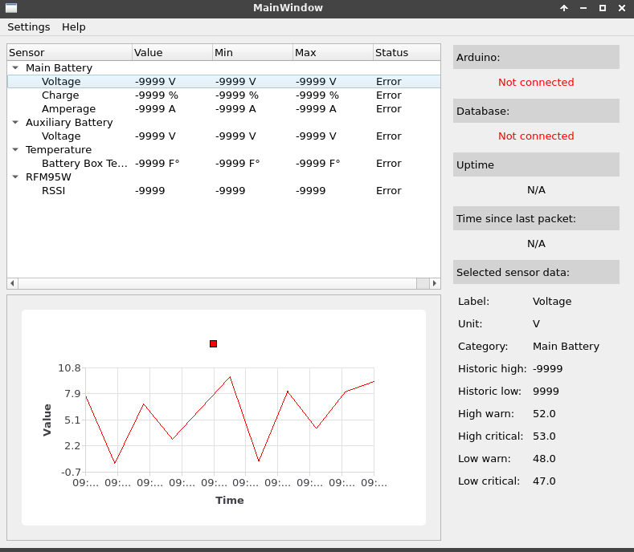

# Telemetry

This is a set of telemetry tools developed for the Solar Car Challenge. As of right now it consists of the
following programs:
 
   - DBTools
       - A GUI wrapper around several PostgreSQL and command line tools to simplify database management, data retrieval and visualization, backups and restoring from a previous state, etc.
   - Telemetry
       - The actual telemetry software, which interfaces with various sensors and inputs from the car, transmits them using a LoRa radio module, then appends it to the database, which is queried to provide data information and visualization to the operator
       
Compatability:
   - 
   - The programs are designed to work on both Linux and Windows operating systems.
   - The arduino code was written to run on an Arduino Uno.
   - Due to complications SQL data definition scripts, as well as a few system-specific files, are not included here. Because of this some of the installation scripts may not work out of the box using only the files provided here. Contact me for more info.

Dependencies:
   -
   - Arduino:
       - RadioHead
       - Arduino IDE (if Arduino programs need to be uploaded)
   - Raspberry Pi:
       - PySide2 (QT)
       - Matplotlib
       - Psycopg2
       - PostgreSQL service
       - PySerial
           
Specifications:
   - 
   - Radio frequency: 905MHz
   - Resistor values for high voltage ADC: 10k and 100k (Drop ~52V to ~4.4V)
